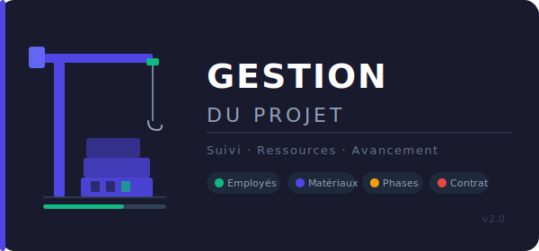

# 🏗️ Gestion du Projet

> Application web de gestion de chantier — 100% locale, aucune dépendance serveur.



## ✨ Fonctionnalités

| Module | Description |
|---|---|
| 📊 Tableau de bord | Vue d'ensemble : salaires, matériaux, avancement |
| 👷 Employés | Fiche employé, groupe sanguin, taux journalier, loyer |
| 📅 Pointage | Grille mensuelle cliquable (Présent / Absent / Congé / Mission) |
| 📄 Contrat | Nom du projet, client, montant, durée, dates |
| 🔷 Phases | Timeline + graphique d'avancement par phase |
| 📦 Matériaux | Catalogue avec quantités, prix unitaires, totaux |

## 🚀 Installation

```bash
git clone https://github.com/votre-username/gestion-projet.git
cd gestion-projet
```

Ouvrez `index.html` dans votre navigateur — **aucun serveur requis**.

## 💾 Stockage

Toutes les données sont sauvegardées dans le **localStorage** du navigateur.  
Aucune donnée n'est envoyée vers un serveur.

## 📁 Structure

```
gestion-projet/
├── index.html   ← Application complète
├── logo.svg     ← Logo du projet
└── README.md    ← Ce fichier
```

## 🖥️ Compatibilité

Navigateurs modernes : Chrome, Firefox, Edge, Safari.

---

**Version 2.0** — Fait avec ❤️ pour la gestion de chantier
